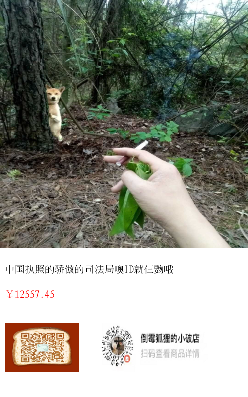

# golang图片海报绘制库

封装了基本的绘制功能，绘制个基本海报还将就吧，更复杂的功能没有添加，原本是准备用在小程序上面的，后来感觉这玩意占用API服务器带宽，还不如在小程序端生成，就先这样吧，后面再有想法再改

```go
package main

import (
	"bytes"
	"image"
	"image/color"
	"io/fs"
	"io/ioutil"
	"github.com/zhimiaox/poster/v1"

	"github.com/golang/freetype"
)

func main() {
	text := `中国执照的骄傲的司法局噢ID就仨覅哦`
	// 字体装载，只支持ttf，部分不规范的ttf无法解析
	file, _ := ioutil.ReadFile("testdata/FeiHuaSongTi-2.ttf")
	trueTypeFont, _ := freetype.ParseFont(file)
	// 创建画布
	ptx := poster.New(500, 800)
	// 绘制颜色
	ptx.DrawColor(color.RGBA{0xff, 0xff, 0xff, 0xff}, image.Rect(0, 0, 500, 800))
	// 将图片绘制到画布
	file, _ = ioutil.ReadFile("testdata/1.jpg")
	_ = ptx.DrawImage(bytes.NewReader(file), image.Rect(0, 0, 500, 500))
	// 绘制文本
	_ = ptx.DrawText(text, image.Pt(10, 550), 20, color.Gray16{Y: 0}, trueTypeFont)
	// 绘制文本
	_ = ptx.DrawText("￥12557.45", image.Pt(10, 600), 20, color.RGBA{0xff, 0, 0, 0xff}, trueTypeFont)
	// 绘制图片
	file, _ = ioutil.ReadFile("testdata/wechat.jpg")
	_ = ptx.DrawImage(bytes.NewReader(file), image.Rect(-10, -550, 140, -650))
	// 绘制图片
	file, _ = ioutil.ReadFile("testdata/mp.png")
	_ = ptx.DrawImage(bytes.NewReader(file), image.Rect(-200, -550, 20, -650))
	// 输出到文件
	output := ptx.Output()
	_ = ioutil.WriteFile("testdata/out.png", output, fs.ModePerm)
}
```

> 效果图



